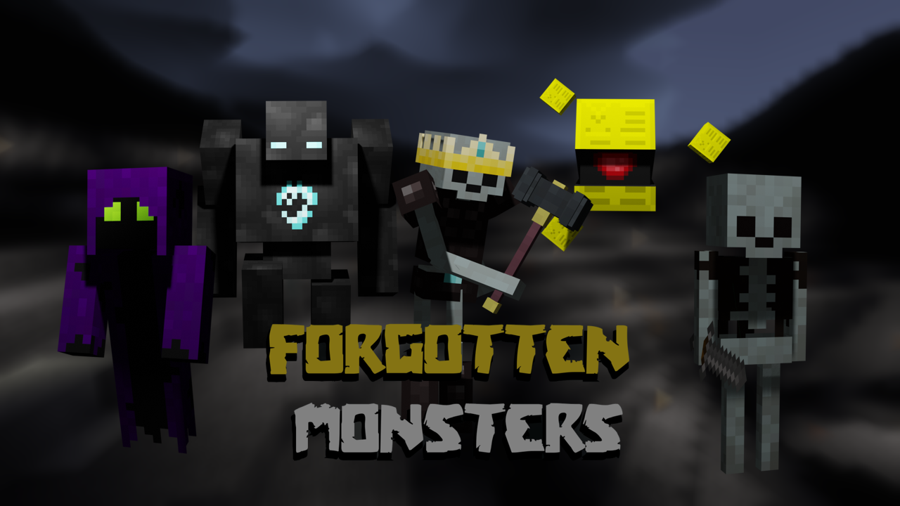

# Forgotten Monsters [`forgotten_monsters`]

This is a fork of the unsupported [monsters mod](https://github.com/minetest-mods-camp/forgotten_monsters) for the minetest game

## Changes

* All monsters are supplied with one mod
* All skeletons removed (except the boss)
* All tools and foods have been removed
* Changed spawn settings
* Stronger and more generous bosses
* Other changes

## Monsters
* Bug Stone
* Golem (Boss)
* Growler
* Hungry
* Mese Lord (Boss)
* Skull King (Boss)
* Spectrum
* Spoky
